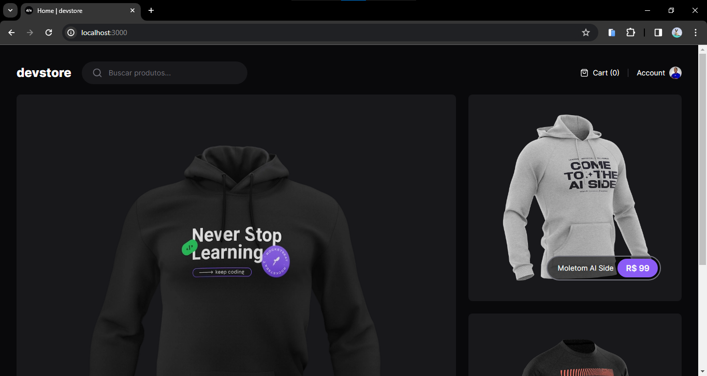

<h1 align="center">Dev Store</h1>

<div align="center">
  
</div>

## 1 - Sobre

Devstore é um projeto de e-commerce de produtos voltados para devs como camisetas, moletons, canecas.

## 2 - Tecnologias

Um pouco das tecnologias que foram utilizadas no projeto:

- NextJS
- TypeScript
- Tailwind CSS
- Zod
- Cypress

## 3 - Rodando o projeto:

Você precisa ter o [Node](https://nodejs.org/en/), o [Git](https://git-scm.com/) e algum gerenciador de pacotes([NPM](https://docs.npmjs.com/downloading-and-installing-node-js-and-npm/) | [Yarn](https://classic.yarnpkg.com/lang/en/docs/install)) instalados em sua máquina.

### Preparando o ambiente

```bash
1. Clone o repositório:
$ git clone https://github.com/felipems1/dev-store.git

2. Acesse a pasta e instale as dependências via terminal:
$ yarn / npm i
```

### Defina as variáveis de ambiente
```bash
1. Renomeie o arquivo
  .env.local.example -> .env.local

2. Substitua os <valores>
  NEXT_PUBLIC_API_BASE_URL=<https://example.com>
  APP_URL=<http://example.com>
```

### Rodando a aplicação

```bash
1. Inicie a aplicação em modo de desenvolvimento:
$ yarn install / npm install

2. O servidor será aberto em http://localhost:3000
```

### Rodando os tests

```bash
1. Com a aplicação em execução, inicie o Cypress:
$ npx cypress open

2. O Cypress será aberto automaticamente no navegador.
```

<p align="center">Projeto feito com ❤️ por <a href="https://www.linkedin.com/in/felipems1/">Felipe Moises</a></p>
